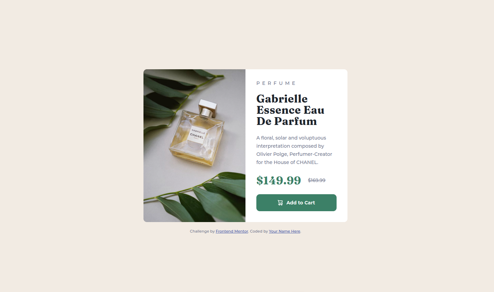

# Frontend Mentor - Product preview card component solution

This is a solution to the [Product preview card component challenge on Frontend Mentor](https://www.frontendmentor.io/challenges/product-preview-card-component-GO7UmttRfa). Frontend Mentor challenges help you improve your coding skills by building realistic projects.

## Table of contents

- [Overview](#overview)
  - [The challenge](#the-challenge)
  - [Screenshot](#screenshot)
  - [Links](#links)
- [My process](#my-process)
  - [Built with](#built-with)
  - [What I learned](#what-i-learned)
  - [Useful resources](#useful-resources)
- [Author](#author)

## Overview

### The challenge

Users should be able to:

- View the optimal layout depending on their device's screen size
- See hover and focus states for interactive elements

### Screenshot



### Links

- Solution URL: [Github Link](https://github.com/Marina5891/FrontendMentor/tree/main/product-preview-card-component-main)

## My process

### Built with

- HTML5
- SCSS
- Flexbox

### What I learned

```scss
$main-font-color: hsl(228, 12%, 48%);

@mixin fontStandart($color: $main-font-color, $weight: 500) {
  font: {
    family: "Montserrat", sans-serif;
    size: 14px;
    weight: $weight;
  }
  color: $color;
}

@mixin flexBox($direction: row, $jc: flex-start, $ai: stretch) {
  display: flex;
  flex-direction: $direction;
  justify-content: $jc;
  align-items: $ai;
}

body {
  @include fontStandart;
  @include flexBox(column, center, center);
  padding: 20px;
  background-color: $bg-color;
  min-height: 100vh;
}
```

### Useful resources

- [SASS-SCSS guide](https://sass-scss.ru/guide/)

## Author

- Telegram - [@MarinaBrov](https://t.me/MarinaBrov)
- Frontend Mentor - [@Marina5891](https://www.frontendmentor.io/profile/Marina5891)
