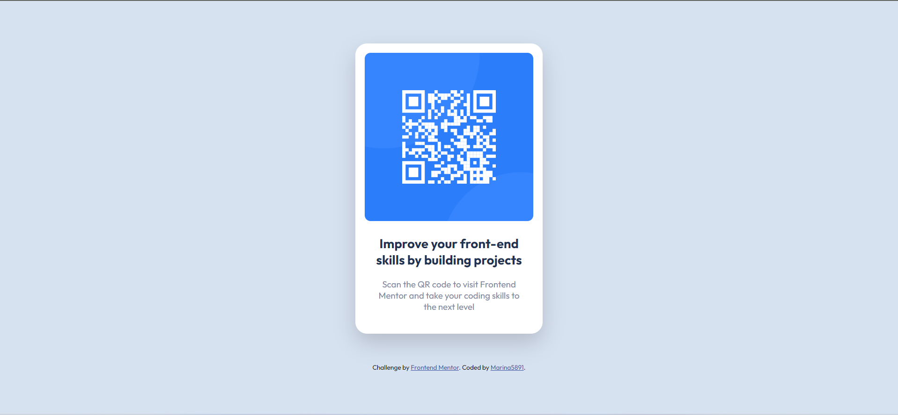

# Frontend Mentor - QR code component solution

## Table of contents

- [Overview](#overview)
  - [Screenshot](#screenshot)
  - [Links](#links)
- [My process](#my-process)
  - [Built with](#built-with)
- [Author](#author)

## Overview

### Screenshot

### Links

- Solution URL: [Github Link](https://github.com/Marina5891/FrontendMentor/tree/main/qr-code-component-main)

## My process

### Built with

- HTML5 markup
- CSS3
- Flexbox

## Author

- Github - [Marina5891](https://github.com/Marina5891)
- Frontend Mentor - [@Marina5891](https://www.frontendmentor.io/profile/Marina5891)