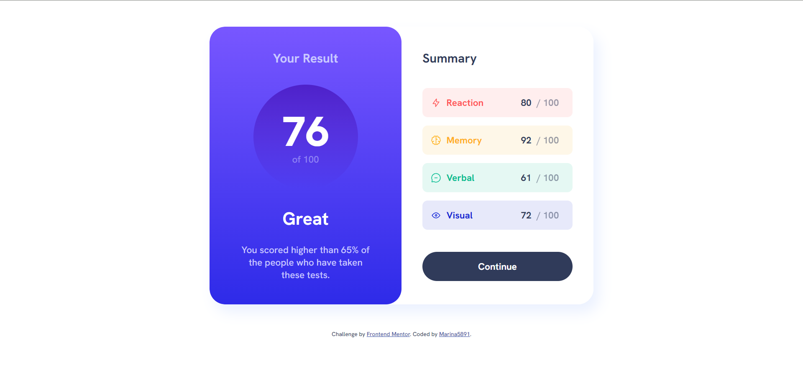

# Frontend Mentor - Results summary component solution 

## Table of contents

- [Overview](#overview)
  - [The challenge](#the-challenge)
  - [Screenshot](#screenshot)
  - [Links](#links)
- [My process](#my-process)
  - [Built with](#built-with)
  - [Useful resources](#useful-resources)
- [Author](#author)

## Overview

### The challenge

Users should be able to:

- View the optimal layout for the interface depending on their device's screen size
- See hover and focus states for all interactive elements on the page
- **Bonus**: Use the local JSON data to dynamically populate the content

### Screenshot

### Links

- Solution URL: [Github link](https://github.com/Marina5891/FrontendMentor/tree/main/results-summary-component-main)

## My process

### Built with

- Semantic HTML5 markup
- CSS3
- Flexbox

### Useful resources

- HTML - [Developer.mozilla.org](https://developer.mozilla.org/ru/docs/Web/HTML)
- CSS - [Developer.mozilla.org](https://developer.mozilla.org/ru/docs/Web/CSS)

## Author

- Github - [Marina5891](https://github.com/Marina5891)
- Frontend Mentor - [@Marina5891](https://www.frontendmentor.io/profile/Marina5891)